# Jarkom-Modul-1-E10-2021

### Kelompok E10

| **No** | **Nama** | **NRP** | 
| ------------- | ------------- | --------- |
| 1 | Muhammad Rizqi Tsani  | 05111940000045 | 
| 2 | Dicksen Alfersius Novian | 05111940000076 |
| 3 | Bill Harit Yafi | 05111940000114 |

## Soal 1

### Soal

### Jawaban

## Soal 2

### Soal

### Jawaban

## Soal 3

### Soal

### Jawaban

## Soal 4

### Soal

### Jawaban

## Soal 5

### Soal

### Jawaban

## Soal 6

### Soal

### Jawaban

## Soal 7

### Soal

### Jawaban

## Soal 8

### Soal

### Jawaban

## Soal 9

### Soal

### Jawaban

## Soal 10

### Soal

### Jawaban

## Soal 11

### Soal
Filter sehingga wireshark hanya mengambil paket yang berasal dari port 80!

### Jawaban
menggunakan capture filter : ```src port 80```

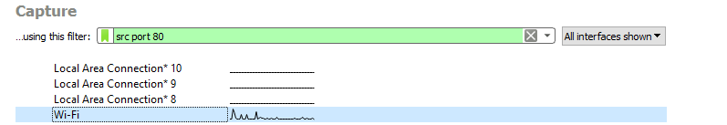

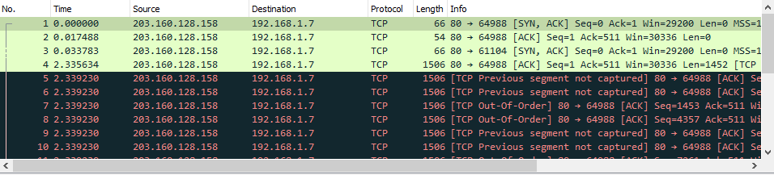

## Soal 12

### Soal
Filter sehingga wireshark hanya mengambil paket yang mengandung port 21!

### Jawaban
menggunakan capture filter : ```port 21```

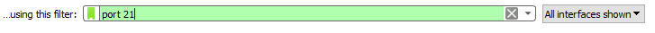

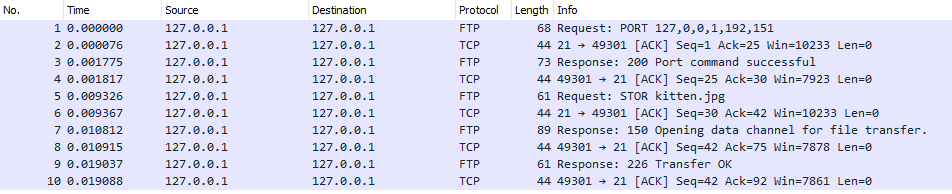

## Soal 13

### Soal
Filter sehingga wireshark hanya menampilkan paket yang menuju port 443!

### Jawaban
menggunakan capture filter : ```dst port 443```

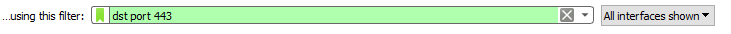

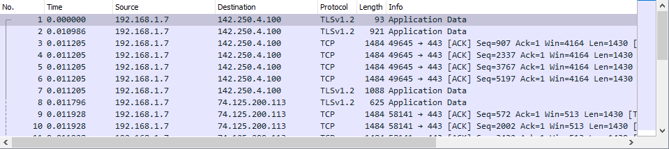

## Soal 14

### Soal
Filter sehingga wireshark hanya mengambil paket yang tujuannya ke kemenag.go.id!

### Jawaban
menggunakan capture filter : ```dst host kemenag.go.id```

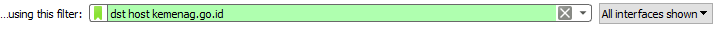

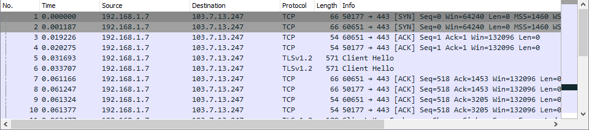

## Soal 15

### Soal
Filter sehingga wireshark hanya mengambil paket yang berasal dari ip kalian!

### Jawaban
Pertama untuk cek IP sendiri, dapat menggunakan Command Prompt (CMD) untuk windows, lalu menjalankan perintah ```ipconfig```

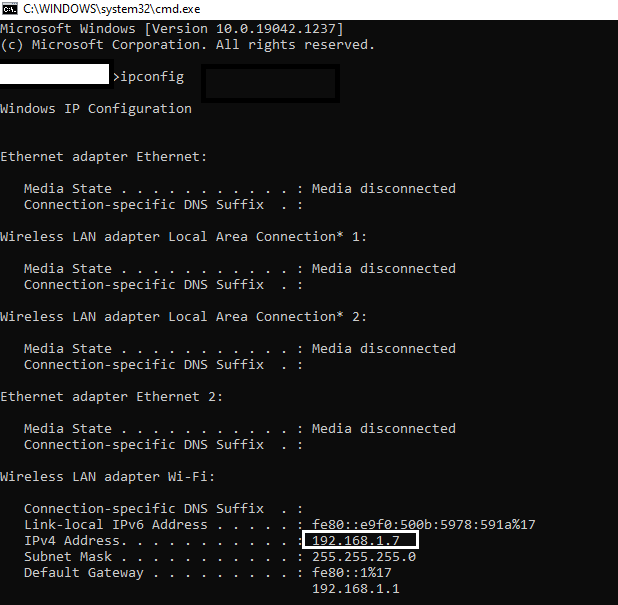

pada contoh diatas, didapat IPv4 Address ```192.168.1.7```. Masukkan dalam capture filter ```src host 192.168.1.7```

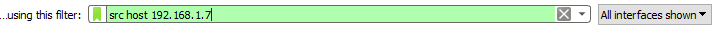

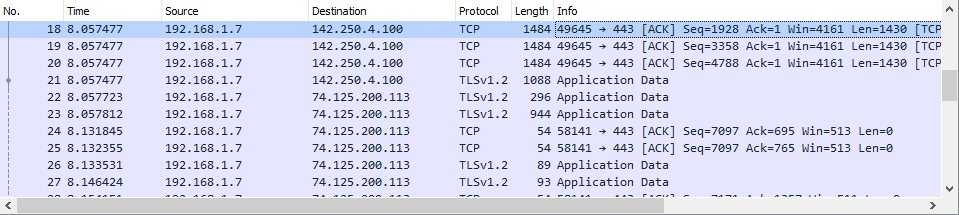

## Kendala

- Kendala jaringan saat praktikum sehingga agak lama mengunduh file-file praktikum
